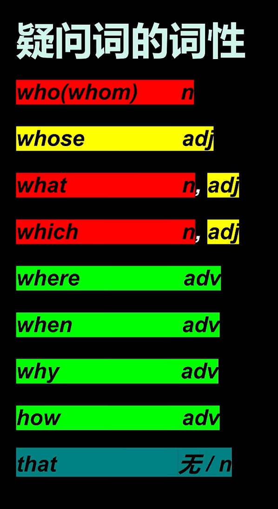

# Larry 语法课笔记

<!--手写笔记到一半发现效率太差 so以后用markdown写-->

## 2.理解了简单句, 你就理解了一切

### 2.2简单句的构成

##### 

##### 1. SV结构(主谓) => 不及物动词

##### 2. SVP结构(主系表) => 系动词:

*He became a thecher when he was 21 years old.*

__* be动词就是"=", 其他系动词就是"≈"。*__

##### 3. SVO(主谓宾) => 及物动词

##### 4. SVO结构(主谓双宾) => 及物动词

##### 5. SVOC结构(主谓宾补) 

*They elected Trump President.*

## 从句比简单句更简单

### 3.1 从句 + 简单句，必有连词

