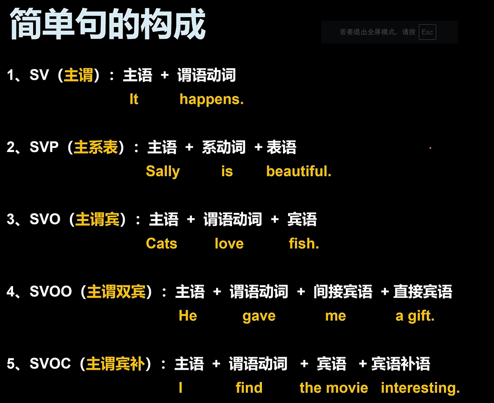

# Larry 语法课笔记

<!--手写笔记到一半发现效率太差 so以后用markdown写-->

## 2.理解了简单句, 你就理解了一切

### 2.2简单句的构成

##### 

##### SV结构(主谓) => 不及物动词

##### SVP结构(主系表) => 系动词:

*He became a thecher when he was 21 years old.*

__*be动词就是"=", 其他系动词就是"≈"。*__

##### SVO(主谓宾) => 及物动词

##### SVO结构(主谓双宾) => 及物动词

##### SVOC结构(主谓宾补) 

*They elected Trump President.*

 

