# 动词时态

时间： 过去 现在 将来 过去将来

状态： 一般 进行 完成 完成进行

<!--时态由时间和状态自由排序组合后有16种--> 

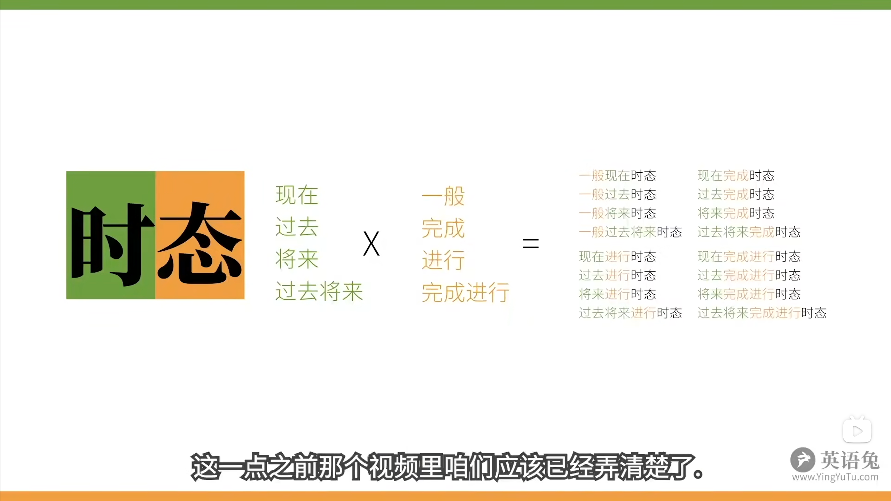

## 1. 一般 现在时态

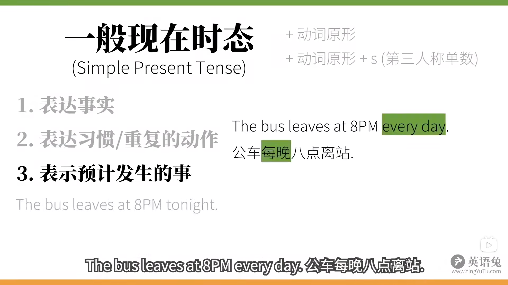

## 2. 现在 进行时态

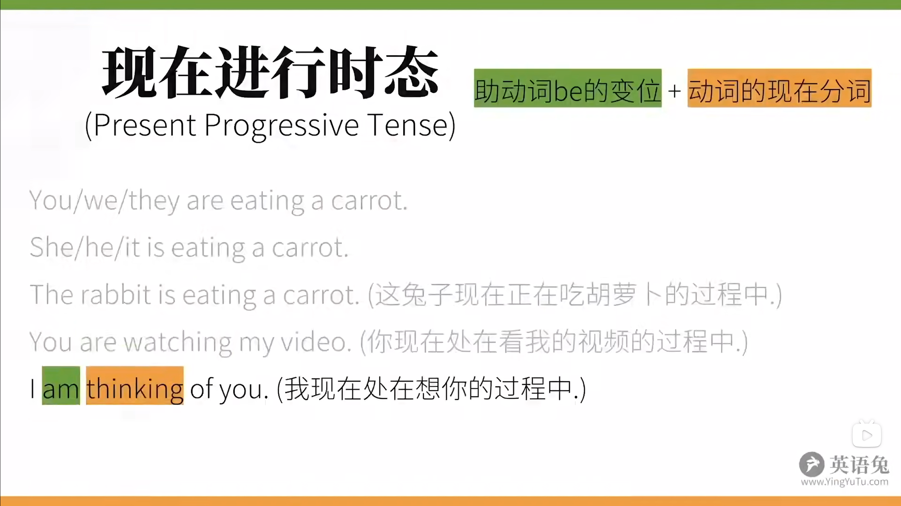

## 3. 现在 完成时态

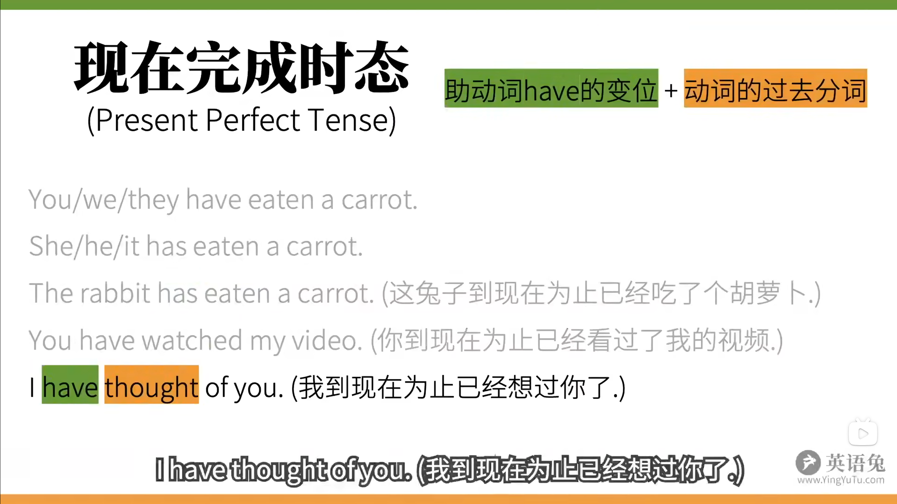

## 4. 现在 完成进行时态

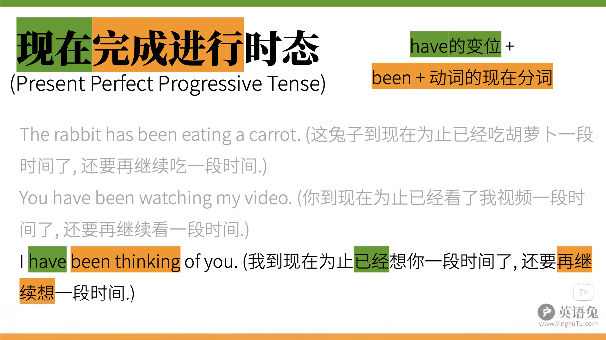

## 5. 一般 过去时态

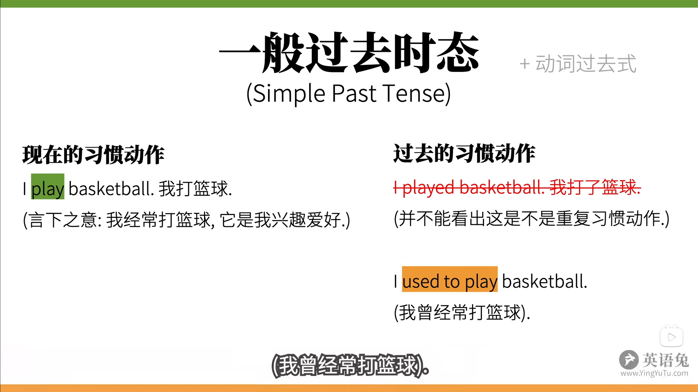

## 6. 过去 进行时态

## 7. 过去 完成时态

## 8. 过去 完成进行时态

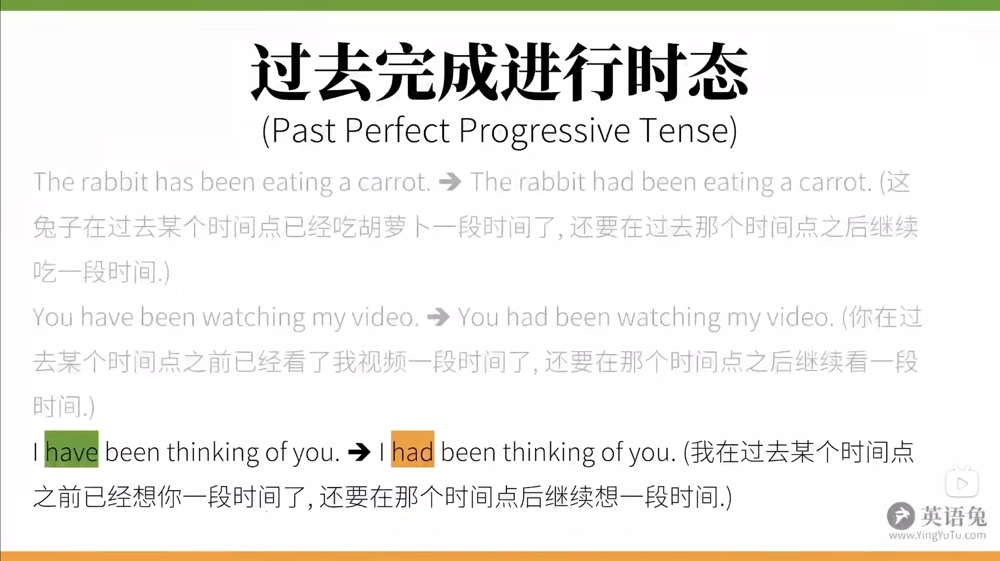

## 9. 一般 将来时态

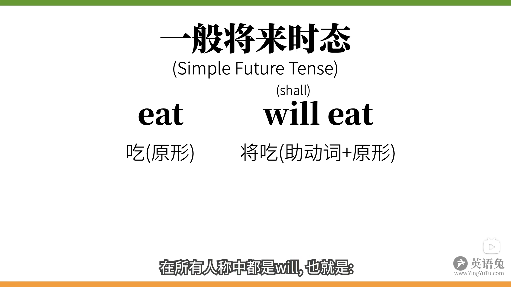

## 10. 将来 进行时态

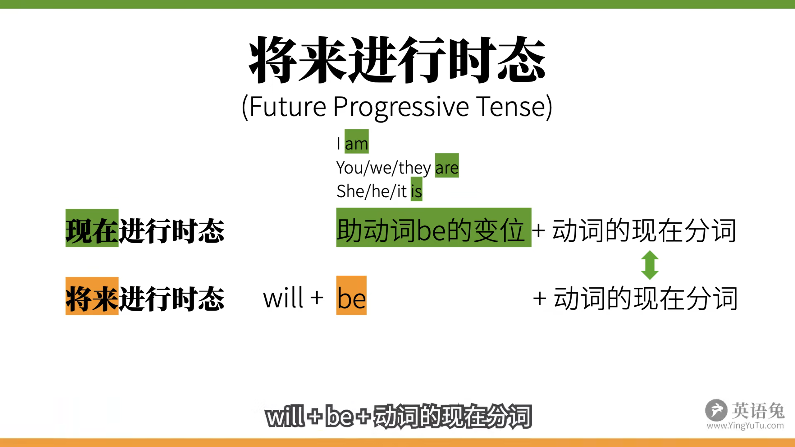

## 11. 将来 完成 时态

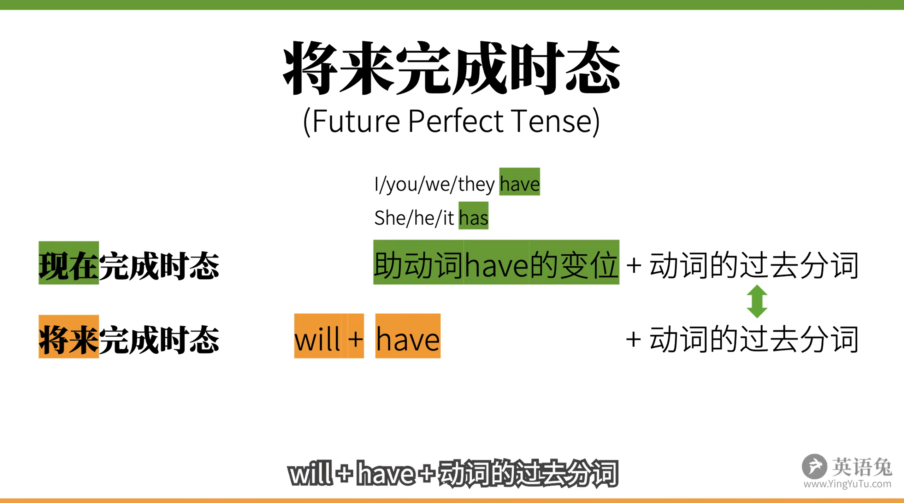

## 12. 将来 完成进行时态

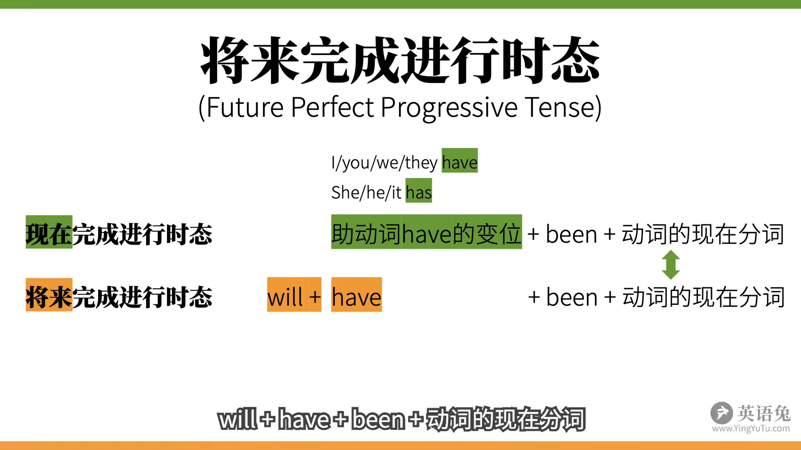

## 13. 一般 过去将来时态

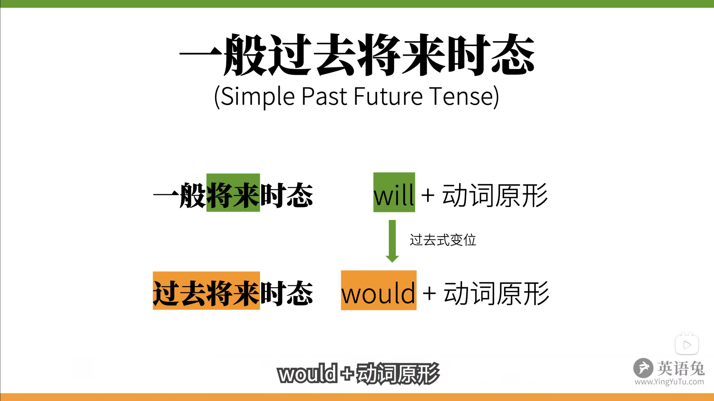

## 14. 过去将来 进行时态

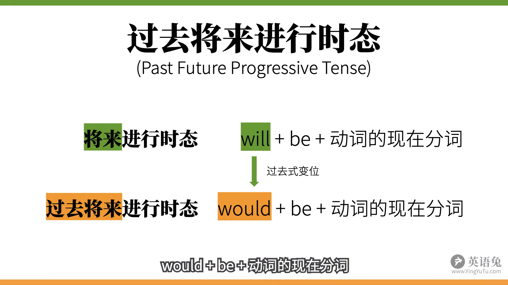

## 15. 过去将来 完成时态

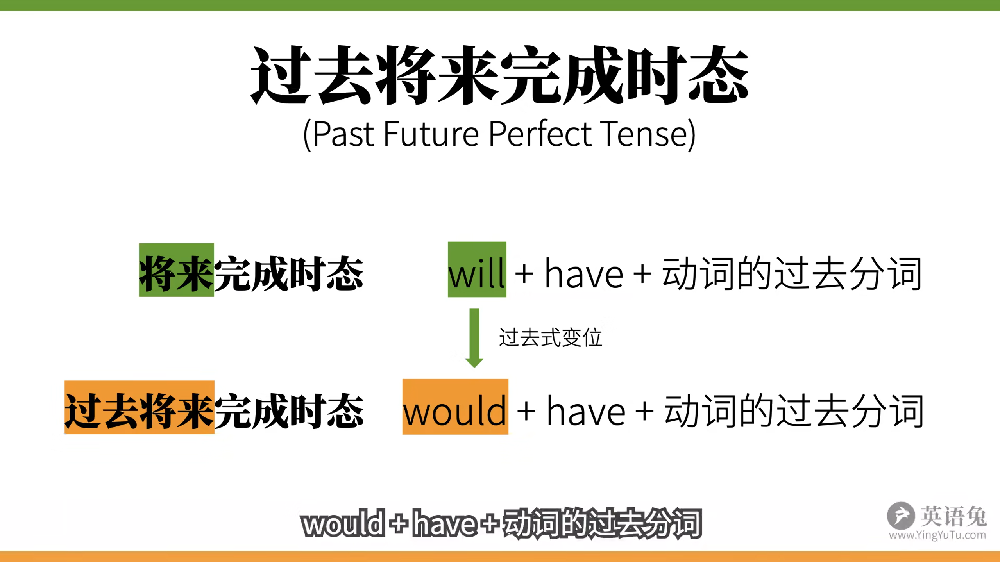

## 16. 过去将来 完成进行时态

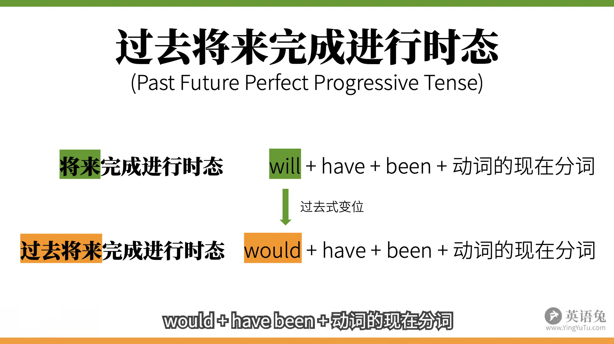
